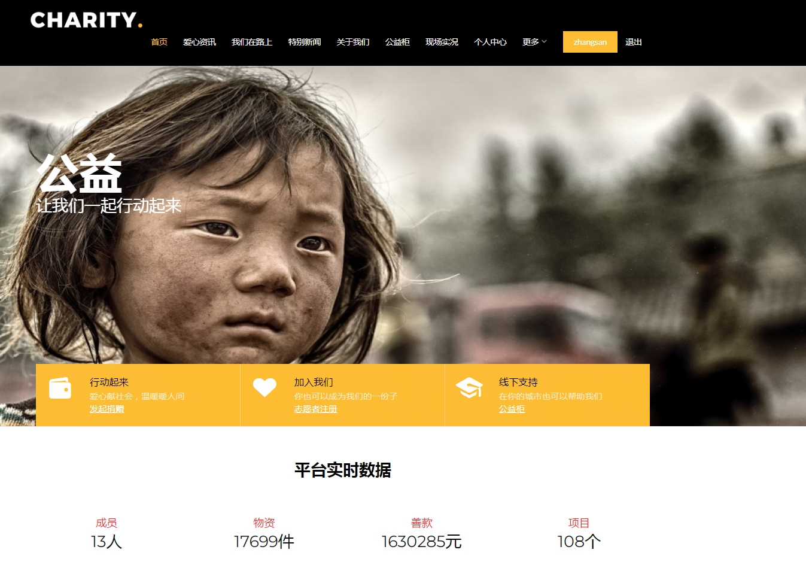
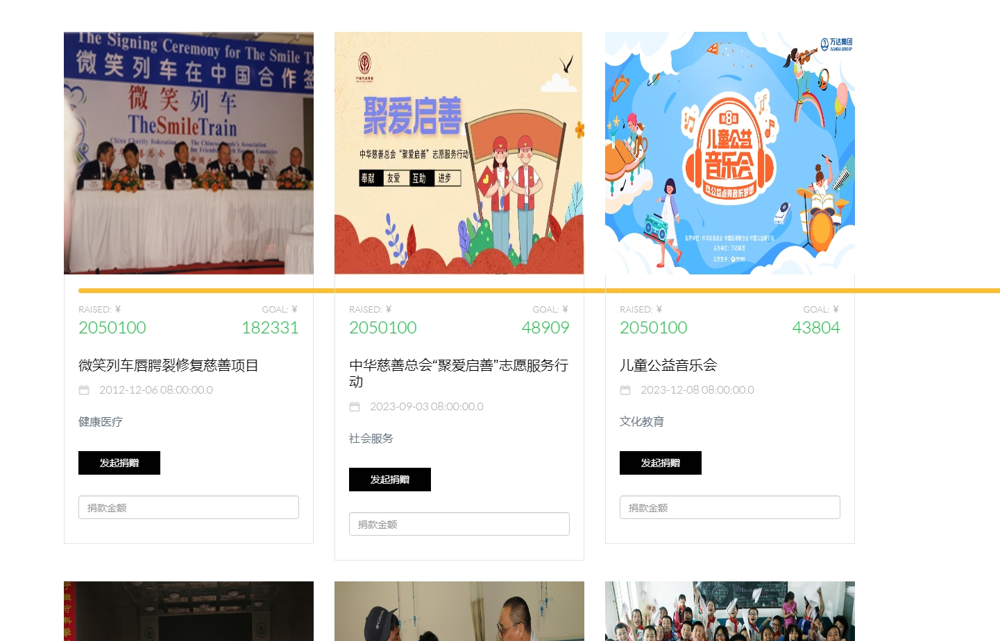
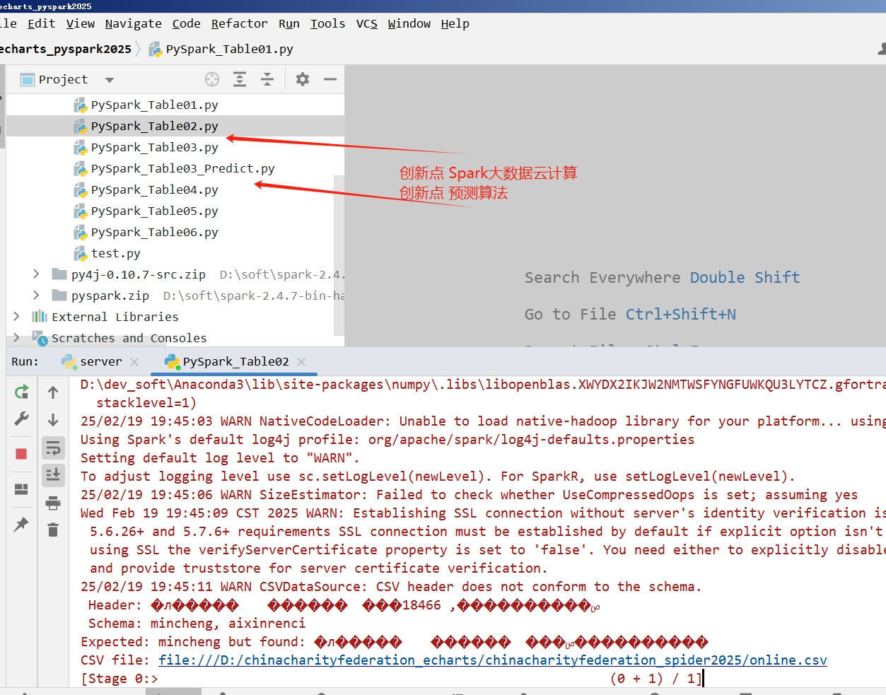

## 计算机毕业设计Hadoop+PySpark+DeepSeek-R1大模型爱心捐赠项目推荐系统 爱心捐赠大数据系统 爱心捐赠大数据可视化 Python中华慈善总会爬虫 情感分析 NLP 自然语言处理 Hive 机器学习 深度学习

## 要求
### 源码有偿！一套(论文 PPT 源码+sql脚本+教程)

### 
### 加好友前帮忙start一下，并备注github有偿大模型慈善推荐2025
### 我的QQ号是2827724252或者798059319或者 1679232425或者微信:bysj2023nb 

# 

### 加qq好友说明（被部分 网友整得心力交瘁）：
    1.加好友务必按照格式备注
    2.避免浪费各自的时间！
    3.当“客服”不容易，repo 主是体面人，不爆粗，性格好，文明人。

​	
## 技术
前端开发：html、css、echarts、jQuery、thymeleaf、ajax
后端开发：springboot+mybatis-plus、flask
数据库：mysql、redis
大模型平台：DeepSeek-R1大模型私有部署本地
爬虫：DrssionPage框架
数据量：50-100万左右

## 创新点
1.阿里云短信验证码修改密码
2.支付宝沙箱支付
3.DeepSeek-R1精调改进优化进行慈善捐赠项目智能推荐
4.Python爬虫采集百万海量数据集
5.JavaMail对捐赠者发送感恩邮件
6.websocket聊天室
7.借助Redis缓存中间件实现同一个平台用户账号多IP登陆自动T掉旧登录地址
8.Hadoop+PySpark对爬虫数据集进行实时分析计算
8.DeepSeek-R1大模型预测未来3天捐赠金额

##  流程
1.Python爬虫采集中华慈善总会的慈善项目、捐款记录信息等约100万数据存入.csv文件和mysql数据库；
2.对csv文件上传hdfs或者存在本地windwos机器，使用PySpark、Hadoop进行分析计算，计算指标存到mysql数据库的table0*表；
3.使用flask+echarts进行可视化大屏开发；
4.基于mysql中的慈善数据集，搭建本地DeepSeek-R1高性能大模型进行智能推荐；
5.使用springboot+mybatis搭建前台系统和后台系统，实现推荐、预测、支付、短信、聊天室、登录、邮箱通知等创新点和业务功能；

## 演示视频
https://www.bilibili.com/video/BV1CBAkeZER7/?spm_id_from=333.1387.homepage.video_card.click

https://www.bilibili.com/video/BV11qAkebEgJ/?spm_id_from=333.1387.homepage.video_card.click

## 演示截图

